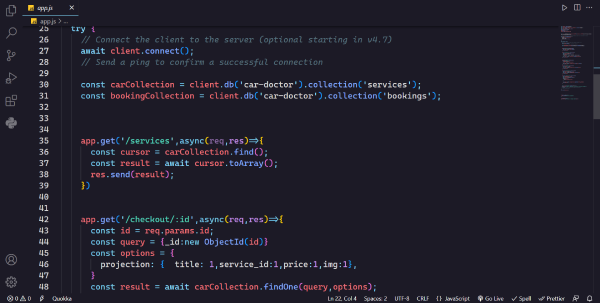

# FabCodeX README


# FabCodeX dark Theme

* FabCodeX is a sleek and modern dark theme designed for VS Code, providing a professional and enjoyable coding experience. With its vibrant colors and clear contrast, FabCodeX makes it easy to read your code and focus on your work for long hours.


## Installation

1. Open Visual Studio Code
2. Click on the "Extensions" icon on the left-hand side of the screen (it looks like four squares)
3. Search for "FabCodeX" in the search bar at the top of the screen
4. Click the "Install" button next to the FabCodeX theme
5. Once installation is complete, click the "Reload" button to activate the theme


## Screenshots

Here are a few screenshots to give you an idea of what FabCodeX looks like in action:




## Contributing

If you find any issues or have any suggestions for improving the FabCodeX theme, please feel free to open an issue or submit a pull request on our GitHub repository. We welcome all contributions and feedback!


## Customization

If you'd like to customize FabCodeX to your liking, you can easily do so by editing your `settings.json` file in Visual Studio Code. Here are a few examples of customization options you might find useful:

```json
{
  "workbench.colorCustomizations": {
    "editor.background": "#1c1c1c",
    "editor.foreground": "#d4d4d4",
    "editor.selectionBackground": "#3a3a3a",
    "editor.lineHighlightBackground": "#2c2c2c"
  },
  "editor.tokenColorCustomizations": {
    "comments": "#6a9955",
    "strings": "#ce9178",
    "keywords": "#dcdcaa",
    "variables": "#9cdcfe"
  }
}


* Try FabCodeX today and experience the perfect balance of style and functionality in your coding environment!

**Enjoy!**
